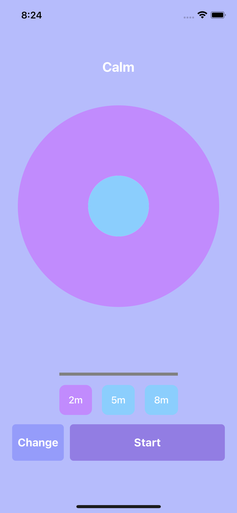

# breath
Breathing exercise visualizer/ practice tool

## Current Breaths (more to be added soon)
* Calm (4s in, 6s out)
* Balance (6s in, 6s out)

## How to add a new breath
1. Go to the types/Exercise.tsx file
2. Add a new case to `Exercise` enum
3. Add the new case and values to the `Exercises` map
